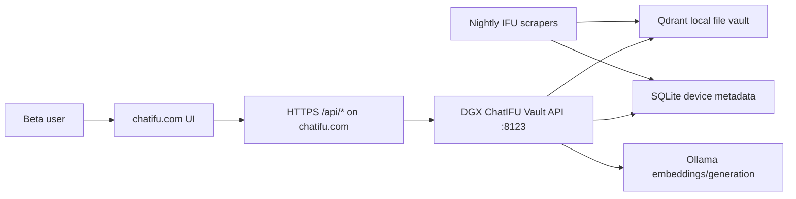

# ChatIFU Beta Production Readiness

Current local status: this workspace contains the DGX vault recovery/backend package, not the full public Streamlit app. Direct SSH to `biscuited@192.168.0.86` timed out from the Mac on 2026-06-19, so DGX runtime state still needs to be verified on the box.

Public site check on 2026-06-19:

- `https://chatifu.com/` loads with the default title `Streamlit`.
- The visible UI is only the Streamlit runtime banner with `Running...`, `Stop`, and `Main menu`.
- `https://chatifu.com/_stcore/health` returns `ok`.
- `https://chatifu.com/healthz` also returns `ok`, likely from the current Streamlit host.
- `https://chatifu.com/api/healthz` is not routed to a backend API yet.
- DNS resolves `chatifu.com` to `216.24.57.1`; response headers include `rndr-id` and `x-render-origin-server`, so the current app appears to be Render behind Cloudflare.
- The DGX is reachable over Tailscale as `spark` / `100.64.103.16`, but it has no Tailscale Serve/Funnel config yet.
- `cloudflared`, Caddy, and nginx are not currently installed on the DGX.

## Ship Blockers

1. Confirm DGX reachability.
   - Direct SSH currently times out from this workspace.
   - If Claude Code is active on the DGX, confirm which ports it owns and keep ChatIFU API on a separate loopback port such as `8123`.

2. Put the API behind HTTPS.
   - Serve `api.py` with Uvicorn on `127.0.0.1`.
   - Expose it through `/api/*` on `chatifu.com` using a reverse proxy, Cloudflare Tunnel, Tailscale Funnel, or the existing host.
   - Map public `/api/healthz` to backend `/healthz`; do not reuse the root `/healthz` path while Streamlit owns it.
   - Do not expose Qdrant, SQLite, Ollama, or Supabase credentials to the public internet.
   - Preferred next step: install Cloudflare Tunnel on the DGX and route `api.chatifu.com` or `chatifu.com/api/*` to `http://127.0.0.1:8123`, because the domain already appears to be Cloudflare-fronted.
   - Alternate next step: enable Tailscale Funnel on the DGX and configure the Render app to call the Funnel HTTPS URL.

3. Require API auth before beta.
   - Set `CHATIFU_API_TOKEN`.
   - Restrict `CHATIFU_ALLOWED_ORIGINS` to `https://chatifu.com,https://www.chatifu.com`.
   - Keep `/api/healthz` public only if the monitor needs it.

4. Validate data migration.
   - Record Supabase `devices` and `documents` counts before export.
   - Record local SQLite device count and Qdrant vector chunk count after import.
   - Run 10 known SKU queries and save expected SKU/source matches.

5. Add safety copy to the UI.
   - Mark the product as beta.
   - Tell users to verify answers against the official IFU/source document.
   - Avoid medical advice framing; this is retrieval over manufacturer/FDA documentation.

## Recommended Beta Architecture



## Optimization Backlog

- Replace per-chunk serial embedding calls with batch embedding if the active Ollama endpoint supports it.
- Persist PDF source URLs and document titles in metadata so UI answers can link to source documents.
- Add a `scrape_runs` writer around nightly jobs so status is queryable without reading logs.
- Add status-specific retry rules: retry transient fetch errors, do not retry known `no_eifu_found` misses until device data changes.
- Add a small golden-query test set for J&J and Stryker before opening beta traffic.
- Add request logging with latency, result count, top score, and anonymized query hash.
- Add response caching for repeated SKU/model queries.
- Add a backup job for `chatifu.sqlite3`, Qdrant storage, and JSONL exports.

## Minimal Launch Commands

```bash
cd /home/biscuited/projects/chatifu_vault
/home/biscuited/projects/chatifu_production/venv/bin/python -m pip install -r requirements.txt
/home/biscuited/projects/chatifu_production/venv/bin/python vault_status.py
CHATIFU_API_TOKEN="$CHATIFU_API_TOKEN" \
CHATIFU_ALLOWED_ORIGINS="https://chatifu.com,https://www.chatifu.com" \
/home/biscuited/projects/chatifu_production/venv/bin/uvicorn api:app --host 127.0.0.1 --port 8123
```

Smoke test:

```bash
curl http://127.0.0.1:8123/healthz
curl -H "Authorization: Bearer $CHATIFU_API_TOKEN" http://127.0.0.1:8123/readyz
curl -H "Authorization: Bearer $CHATIFU_API_TOKEN" \
  -H "Content-Type: application/json" \
  -d '{"question":"Stryker 17-0186 instructions for use","limit":3}' \
  http://127.0.0.1:8123/query
```

## Current DGX Runtime

As of 2026-06-19, the DGX has a user-level systemd service:

```bash
systemctl --user status chatifu-vault-api.service --no-pager
systemctl --user restart chatifu-vault-api.service
```

The service is bound to `127.0.0.1:8123` and uses `/home/biscuited/projects/chatifu_vault/.env`.

Observed smoke-test latencies after Qdrant warm-up:

- `/healthz`: about 0.004s
- `/readyz`: about 0.04s warm, about 40s cold while local Qdrant opens 575k points
- `/stats`: about 0.01s warm
- `/query` with SKU auto-filter: about 3.6s
- `/ask` with local `qwen3:14b`: about 29-36s
